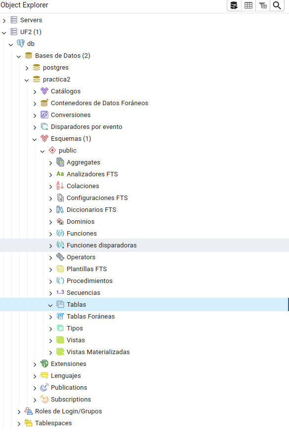
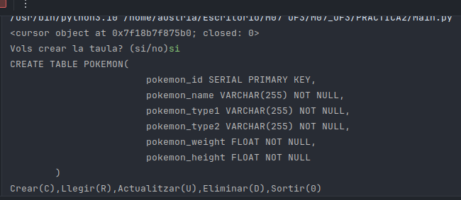
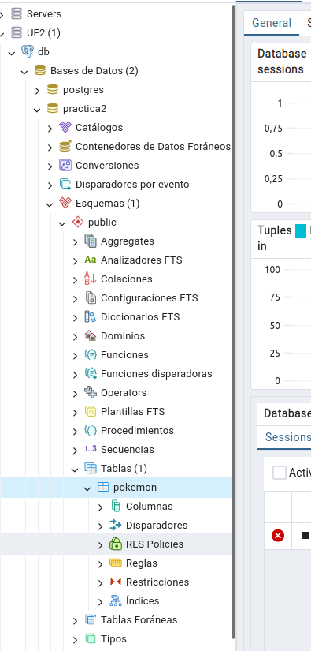
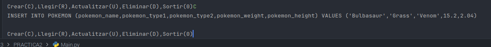
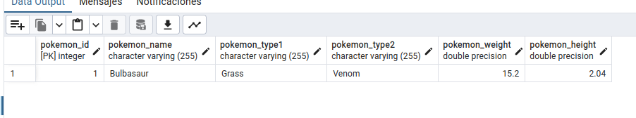
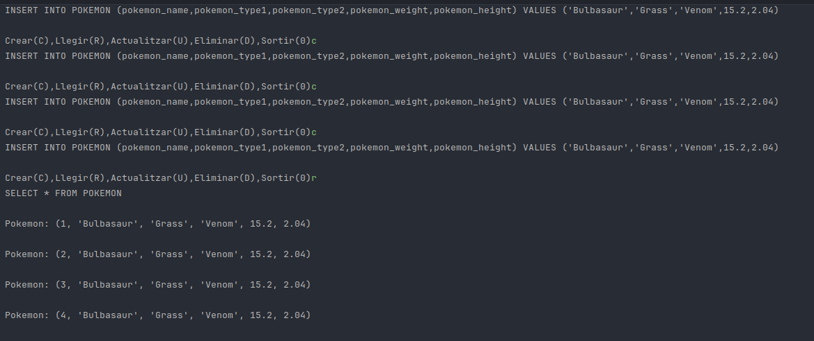
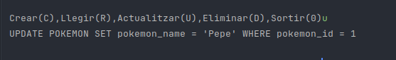
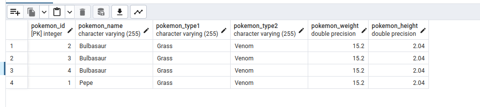
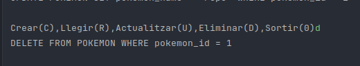
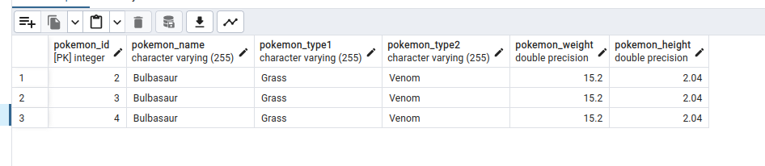

# PRACTICA 2 CRUD

<li> Aquesta es la taula sense dades de la qual partim: </li>

<h2>Create table: </h2>

<li> Aquesta es la query i el resultat </li>

<h2> Create: </h2>

<h2> Read: </h2>

En aquest cas vaig fer més inserts per aixi poder veure moltes dades:

<h2> Update: </h2>

<h2> Delete </h2>

